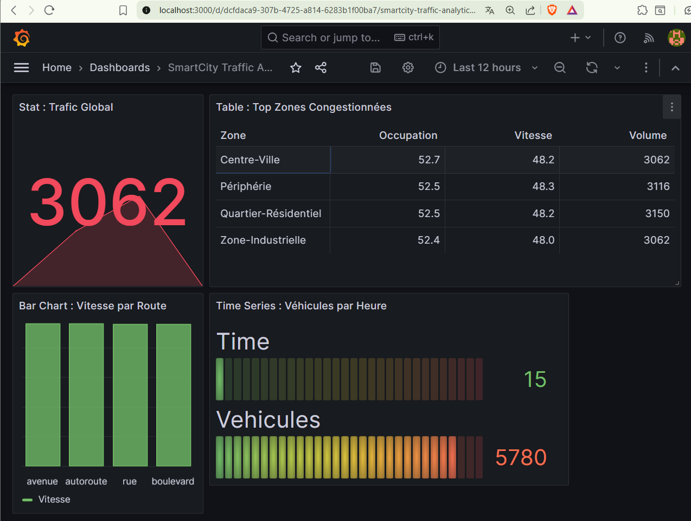

# SmartCity Traffic Analytics – Pipeline Big Data End-to-End

## 🎯 Objectif du Projet

Pipeline Big Data complet pour analyser le trafic urbain en temps réel :

1. **Génération** de données de trafic réalistes
2. **Ingestion** via Kafka
3. **Stockage** partitionné dans HDFS (Data Lake)
4. **Traitement** avec Spark (KPIs de congestion)
5. **API REST** avec FastAPI
6. **Visualisation** avec Grafana

**État actuel** : ✅ **Étapes 1-6 complètes** (Pipeline opérationnel de bout en bout)

---

## 🛠️ Stack Technique (Docker)

| Service           | Version | Port       | Rôle                      |
| ----------------- | ------- | ---------- | ------------------------- |
| **Kafka**         | 7.5.0   | 9093       | Broker de messages        |
| **Zookeeper**     | 7.5.0   | 2181       | Coordination Kafka        |
| **HDFS Namenode** | 3.2.1   | 9870       | Métadonnées HDFS          |
| **HDFS Datanode** | 3.2.1   | -          | Stockage blocs HDFS       |
| **Spark Master**  | 3.5.1   | 8080, 7077 | Orchestration traitements |
| **Spark Worker**  | 3.5.1   | 8081       | Exécution jobs Spark      |
| **API Analytics** | 3.10    | 8000       | API REST FastAPI          |
| **Grafana**       | latest  | 3000       | Visualisation dashboards  |
| **Airflow**       | 2.9.3   | 8085       | Orchestration DAGs        |
| **PostgreSQL**    | 13      | 5432       | Métadonnées Airflow       |

---

## 📂 Architecture du Projet

```
SmartCity_Traffic_Pipeline/
├── docker-compose.yml          # Stack complète (13 services)
├── .env                        # Variables d'environnement
├── scripts/
│   ├── traffic_data_generator.py   # Génération d'événements
│   ├── kafka_producer.py           # Producteur Kafka
│   ├── kafka_to_hdfs.py            # Consommateur → HDFS
│   ├── spark_traffic_processing.py # Traitement Spark (KPIs)
│   └── read_spark_results.py       # Lecture résultats Parquet
├── api/
│   ├── api_analytics.py            # API FastAPI
│   └── requirements.txt            # Dépendances API
├── dags/                       # DAGs Airflow (à venir)
├── logs/                       # Logs Airflow
├── captures/                   # Screenshots du pipeline
├── GRAFANA_GUIDE.md            # Guide configuration Grafana
├── SPARK_SUBMIT_GUIDE.md       # Guide soumission jobs Spark
└── README.md
```

---

## 🚀 Démarrage Rapide

### 1️⃣ Prérequis

- Docker Desktop + Docker Compose
- Python 3.8+ (pour le producteur Kafka)
- 8 GB RAM minimum

### 2️⃣ Lancer la stack Docker

```powershell
docker compose up -d
```

**Attendre ~60s** que tous les services soient **healthy** :

```powershell
docker compose ps
```

### 3️⃣ Créer le répertoire HDFS de base

```powershell
docker exec -it namenode hdfs dfs -mkdir -p /user/hdfs/traffic
docker exec -it namenode hdfs dfs -chown -R hdfs:hdfs /user/hdfs/traffic
```

### 4️⃣ Lancer le producteur (génère des événements)

```powershell
python scripts/kafka_producer.py
```

### 5️⃣ Vérifier que le consumer écrit dans HDFS

```powershell
docker logs -f consumer
```

**Logs attendus** :

```
Consumer Kafka initialisé avec bootstrap.servers=kafka:9093
Écrit 50 messages dans /user/hdfs/traffic/year=2026/month=01/day=11/zone=Centre-Ville/traffic_*.jsonl
```

### 6️⃣ Soumettre le job Spark (KPIs)

```powershell
# Copier le script
docker cp scripts/spark_traffic_processing.py spark-master:/tmp/

# Soumettre le job
docker exec -it spark-master /opt/spark/bin/spark-submit `
    --master spark://spark-master:7077 `
    --deploy-mode client `
    --executor-memory 2g `
    --total-executor-cores 2 `
    /tmp/spark_traffic_processing.py
```

### 7️⃣ Tester l'API

```powershell
Invoke-WebRequest -Uri "http://localhost:8000/traffic/zones" -UseBasicParsing | Select-Object -ExpandProperty Content
```

### 8️⃣ Accéder à Grafana

- URL : **http://localhost:3000** (admin/admin)
- Installer plugin : `docker exec -it grafana grafana-cli plugins install simpod-json-datasource`
- Configurer Data Source : `http://host.docker.internal:8000`
- Créer dashboard (voir `GRAFANA_GUIDE.md`)

---

## 📊 Pipeline de Données

```
┌─────────────────┐      ┌──────────┐      ┌──────────┐
│ traffic_data_   │─────▶│  Kafka   │─────▶│   HDFS   │
│ generator.py    │      │  Topic   │      │ (JSON L) │
└─────────────────┘      └──────────┘      └──────────┘
                                                  │
                                                  ▼
                                           ┌──────────┐
                                           │  Spark   │
                                           │  (KPIs)  │
                                           └──────────┘
                                                  │
                                                  ▼
                                           ┌──────────┐
                                           │  Parquet │
                                           │ Analytics│
                                           └──────────┘
                                                  │
                                                  ▼
                                           ┌──────────┐
                                           │ FastAPI  │
                                           │   API    │
                                           └──────────┘
                                                  │
                                                  ▼
                                           ┌──────────┐
                                           │ Grafana  │
                                           │Dashboard │
                                           └──────────┘
```

---

## 📊 Étapes Réalisées

### ✅ Étape 1 – Génération de Données Réalistes

**Fichier** : `scripts/traffic_data_generator.py`

Génère des événements JSON simulant le trafic urbain avec :

- 20 capteurs (IDs 1-20)
- 4 zones : Centre-Ville, Périphérie, Quartier-Résidentiel, Zone-Industrielle
- 4 types de routes : autoroute, avenue, rue, boulevard
- Patterns temporels : heures de pointe (7h-9h, 17h-20h), normales, nuit
- Anomalies : accidents (5% probabilité) avec baisse de vitesse et hausse d'occupation

**Format JSON** :

```json
{
  "sensor_id": 12,
  "timestamp": "2026-01-11T15:17:32.123456+00:00",
  "zone": "Centre-Ville",
  "road_type": "avenue",
  "vehicle_count": 87,
  "average_speed": 42,
  "occupancy_rate": 58
}
```

---

### ✅ Étape 2 – Ingestion Kafka

**Fichier** : `scripts/kafka_producer.py`

- Producteur Kafka avec `confluent-kafka`
- Topic : `traffic-events`
- `acks='all'` : garantit la livraison
- Intervalle : 2 secondes entre chaque événement
- Logs : `Message envoyé au topic traffic-events : 12 - Centre-Ville`

---

### ✅ Étape 3 – Consommation Kafka

**Fichier** : `kafka_to_hdfs.py`

- Consumer Group : `hdfs-consumer-group`
- Auto-offset : `earliest` (relit depuis le début si nouveau groupe)
- Service Docker `consumer` qui tourne en continu

---

### ✅ Étape 4 – Stockage HDFS Partitionné

**Fichier** : `scripts/kafka_to_hdfs.py`

**Caractéristiques** :

- **Micro-batching** : 50 messages OU 30 secondes
- **Format** : JSON Lines (`.jsonl`)
- **Partitionnement dynamique** :
  ```
  /user/hdfs/traffic/
    year=2026/
      month=01/
        day=11/
          zone=Centre-Ville/
            traffic_20260111151732.jsonl
          zone=Périphérie/
            traffic_20260111151755.jsonl
  ```
- **Un fichier par zone et par batch** (évite les "petits fichiers")

---

### ✅ Étape 5 – Traitement Batch avec Spark

**Fichier** : `scripts/spark_traffic_processing.py`

**Objectif** : Transformer les données brutes HDFS en KPIs analytiques.

**Architecture** :

- **Lecture** : Fichiers JSON Lines depuis `/user/hdfs/traffic/*/*/*/*/*.jsonl`
- **Session Spark** : `spark://spark-master:7077` (mode cluster)
- **Nettoyage** :
  - Filtrage : `speed >= 0` ET `occupancy_rate <= 100`
  - Déduplications : sur `sensor_id` + `timestamp`
- **UDF** : `congestion_level(occupancy, speed)` → 4 niveaux :
  - **Fluide** : occupancy < 40% ET speed > 50 km/h
  - **Modéré** : 40% ≤ occupancy < 70% OU 30 < speed ≤ 50
  - **Dense** : 70% ≤ occupancy < 85% OU 20 < speed ≤ 30
  - **Bloqué** : occupancy ≥ 85% OU speed ≤ 20

**KPIs calculés** :

1. **Vitesse moyenne par `road_type`** → `/data/analytics/traffic/kpi_road_type`
2. **Occupation moyenne par `zone`** (partitionné) → `/data/analytics/traffic/kpi_zone/zone=...`
3. **Véhicules par heure** → `/data/analytics/traffic/kpi_hourly`
4. **Répartition congestion** → `/data/analytics/traffic/kpi_congestion`

**Sortie** :

- **Parquet** partitionné (analytics)
- **CSV** échantillon (1000 lignes pour debugging) → `/data/processed/traffic`

---

### ✅ Étape 6 – API REST et Visualisation

**Fichiers** : `api/api_analytics.py`, `GRAFANA_GUIDE.md`

**API FastAPI** (service Docker `api-analytics`) :

- **Port** : 8000
- **Endpoints REST** :
  - `GET /traffic/zones` : Volume par zone
  - `GET /traffic/congestion` : Top 5 zones congestionnées
  - `GET /traffic/speed` : Vitesse par road_type
  - `GET /traffic/trends` : Véhicules par heure
- **Cache** : 5 minutes
- **CORS** : Activé pour Grafana
- **Gestion partitions Spark** : Extraction automatique de la colonne `zone` depuis le chemin

**Grafana Dashboard** :

- Plugin : `simpod-json-datasource`
- Data Source : `http://host.docker.internal:8000`
- **4 Panels** :
  1. **Stat** : Trafic global (3062 événements)
  2. **Table** : Top zones congestionnées (Centre-Ville, Périphérie, etc.)
  3. **Bar Chart** : Vitesse par type de route
  4. **Time Series** : Véhicules par heure





---

## 🛠️ Problèmes Résolus

| Problème                                                         | Cause                                                                       | Solution                                                         |
| ---------------------------------------------------------------- | --------------------------------------------------------------------------- | ---------------------------------------------------------------- |
| **Permission denied HDFS**                                       | Le répertoire `/data/raw/traffic` appartenait à `root`.                     | Utiliser `/user/hdfs/traffic` (propriétaire : `hdfs`).           |
| **`socket.gaierror` DataNode**                                   | Le consumer Windows ne résolvait pas le hostname du DataNode Docker.        | Exécuter le consumer**dans Docker** (service `consumer`).        |
| **`Connection refused localhost:9093`**                          | Kafka annonçait `localhost:9093` au lieu de `kafka:9093`.                   | Corriger `KAFKA_ADVERTISED_LISTENERS` dans `docker-compose.yml`. |
| **Consumer lit `localhost` malgré `KAFKA_BOOTSTRAP=kafka:9093`** | Le consumer Kafka était créé au niveau module (avant lecture des env vars). | Déplacer la création du consumer**dans `main()`**.               |
| **`spark-submit` introuvable**                                   | L'image Spark n'a pas `spark-submit` dans le `$PATH`.                       | Utiliser `/opt/spark/bin/spark-submit`.                          |
| **Erreur "seek" lecture Parquet API**                            | `pyarrow` ne peut pas lire depuis un stream HDFS non-seekable.              | Charger les fichiers en mémoire avec `io.BytesIO`.               |
| **Zone affiche "Inconnu" dans l'API**                            | Spark partitionne par `zone=...`, la colonne n'est pas dans les Parquet.    | Extraire `zone` depuis le chemin de partition.                   |

---

## 📋 Fichiers Clés

### `docker-compose.yml`

- **Kafka** : `KAFKA_ADVERTISED_LISTENERS: PLAINTEXT://kafka:9092,PLAINTEXT_HOST://kafka:9093`
- **Service `consumer`** : Exécute `kafka_to_hdfs.py` automatiquement
- **Service `api`** : FastAPI sur port 8000

### `scripts/kafka_to_hdfs.py`

- Variables d'environnement lues correctement
- Consumer créé **dans `main()`** (pas au niveau module)
- Gestion d'erreurs robuste pour la création de répertoires HDFS

### `api/api_analytics.py`

- Lecture récursive des partitions Spark
- Extraction de `zone` depuis le chemin
- Cache 5 minutes pour optimiser les performances

---

## 🔧 Commandes Utiles

```powershell
# Redémarrer la stack complète
docker compose down
docker compose up -d

# Voir les logs d'un service
docker logs -f consumer
docker logs -f api-analytics
docker logs -f kafka
docker logs -f namenode

# Vérifier l'état des services
docker compose ps

# Supprimer les données HDFS (pour repartir de zéro)
docker exec -it namenode hdfs dfs -rm -r -skipTrash /user/hdfs/traffic
docker exec -it namenode hdfs dfs -mkdir -p /user/hdfs/traffic
docker exec -it namenode hdfs dfs -chown -R hdfs:hdfs /user/hdfs/traffic

# Lister les topics Kafka
docker exec -it kafka kafka-topics --bootstrap-server localhost:9093 --list

# Consommer le topic manuellement
docker exec -it kafka kafka-console-consumer \
    --bootstrap-server localhost:9093 \
    --topic traffic-events \
    --from-beginning \
    --max-messages 5

# Vérifier KPIs Parquet
docker exec -it namenode hdfs dfs -ls /data/analytics/traffic/kpi_zone

# Tester l'API
Invoke-WebRequest -Uri "http://localhost:8000/traffic/zones" -UseBasicParsing
```

---

## 🎯 Validation Complète

### ✅ Étape 4 - Stockage HDFS

```powershell
docker exec -it namenode hdfs dfs -ls /user/hdfs/traffic/year=2026/month=01/day=11
docker exec -it namenode hdfs dfs -cat /user/hdfs/traffic/year=2026/month=01/day=11/zone=Centre-Ville/traffic_*.jsonl | Select-Object -First 5
```

### ✅ Étape 5 - Traitement Spark

```powershell
docker exec -it namenode hdfs dfs -ls /data/analytics/traffic/kpi_congestion
docker exec namenode hdfs dfs -cat /data/processed/traffic/part-00000-*.csv > results.csv
Get-Content results.csv -Head 20
```

### ✅ Étape 6 - API et Grafana

```powershell
Invoke-WebRequest -Uri "http://localhost:8000/traffic/zones" -UseBasicParsing | Select-Object -ExpandProperty Content
```

**Dashboard Grafana** : http://localhost:3000
**Screenshot** : `captures/e6-dashbord.png` (4 panels opérationnels)

---

## 🎉 Prochaine Étape

### Étape 7 – Orchestration Airflow

- DAG quotidien : traitement batch Spark automatique
- DAG de monitoring : vérification santé du pipeline
- Alertes en cas d'échec

---

## 📌 Règles de Développement

1. **Code** : clair, simple, directement utilisable
2. **Dépendances** : uniquement la stack définie (pas d'ajouts non validés)
3. **Sécurité** : variables d'environnement (pas de secrets en dur)
4. **Exceptions** : gestion propre avec logs explicites
5. **Commentaires** : expliquer le "Pourquoi", pas le "Quoi"

---

## 🔗 Liens Utiles

- **HDFS NameNode UI** : http://localhost:9870
- **Spark Master UI** : http://localhost:8080
- **Spark Worker UI** : http://localhost:8081
- **API Analytics** : http://localhost:8000
- **Grafana** : http://localhost:3000
- **Airflow** : http://localhost:8085

---

**Projet réalisé par** : Mohamed BOULAA LAM
**Contact** : [GitHub](https://github.com/MohamedBOULAALAM/SmartCity_Traffic_Pipeline)
**Date** : Janvier 2026
