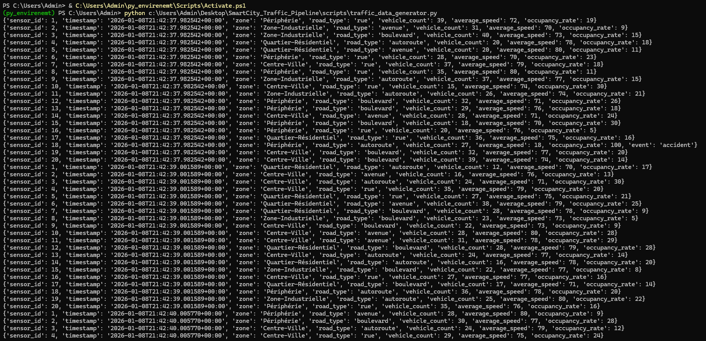
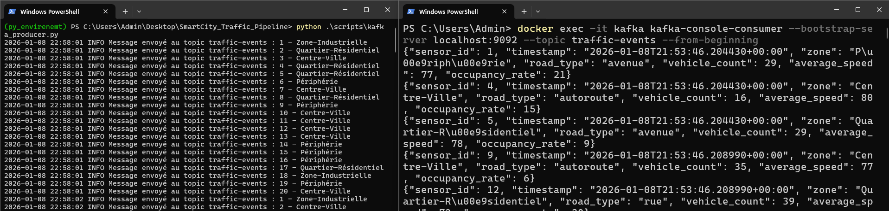
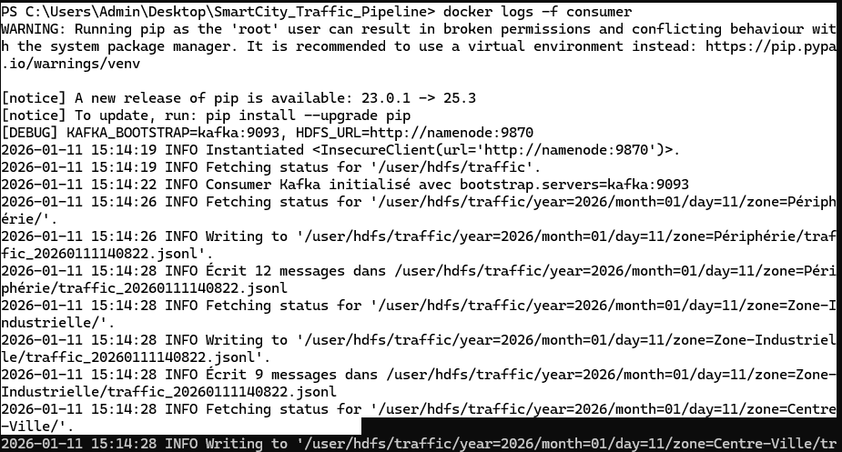
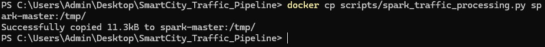
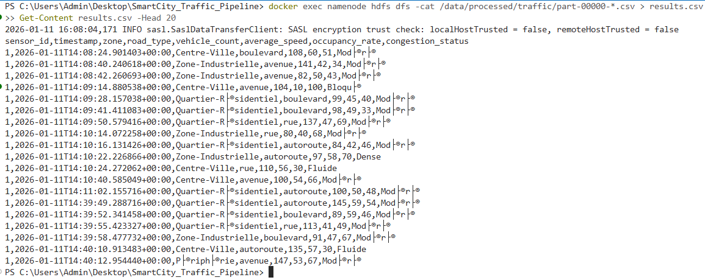
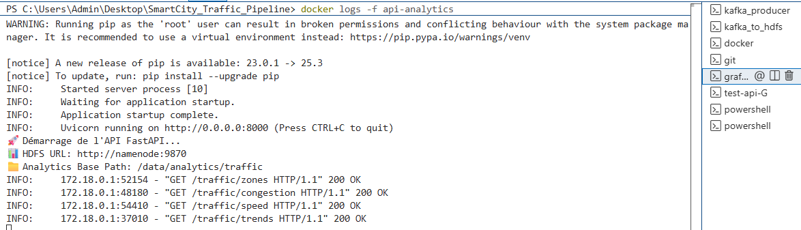
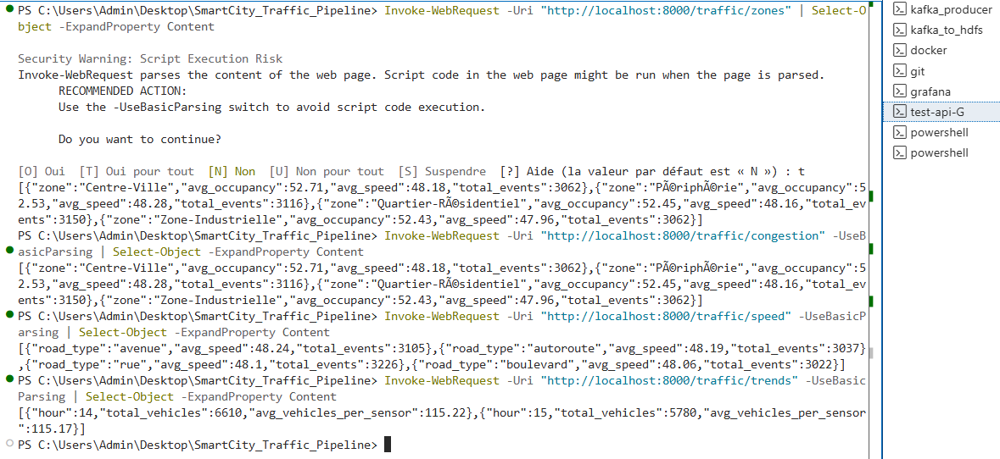

# 🚦 SmartCity Traffic Analytics Pipeline

<div align="center">


**Pipeline Big Data End-to-End pour l'analyse du trafic urbain en temps réel**

[Architecture](#-architecture) •
[Installation](#-installation-rapide) •
[Documentation](#-documentation) •
[Captures](#-captures-décran)

</div>

---

## 📋 Table des Matières

- [🎯 Présentation](#-présentation)
- [🏗️ Architecture](#️-architecture)
- [🛠️ Stack Technique](#️-stack-technique)
- [🚀 Installation Rapide](#-installation-rapide)
- [📊 Étapes du Pipeline](#-étapes-du-pipeline)
- [📸 Captures d&#39;écran](#-captures-décran)
- [📚 Documentation](#-documentation)
- [🔧 Commandes Utiles](#-commandes-utiles)
- [🎯 Validation](#-validation)
- [👤 Auteur](#-auteur)

---

## 🎯 Présentation

Ce projet implémente un **pipeline Big Data complet** pour analyser le trafic urbain en temps réel dans une Smart City. Le système ingère, traite et visualise des données de capteurs de trafic pour fournir des insights sur la congestion, la vitesse moyenne et les patterns de circulation.

### Fonctionnalités Principales

✅ **Génération de données réalistes** avec patterns temporels et anomalies
✅ **Ingestion temps réel** via Apache Kafka
✅ **Stockage partitionné** dans HDFS (Data Lake)
✅ **Traitement distribué** avec Apache Spark (KPIs)
✅ **API REST** avec FastAPI pour exposer les métriques
✅ **Dashboards interactifs** avec Grafana
✅ **Orchestration automatique** avec Apache Airflow

---

## 🏗️ Architecture

```
┌─────────────────────────────────────────────────────────────────────┐
│                      SMARTCITY TRAFFIC PIPELINE                     │
└─────────────────────────────────────────────────────────────────────┘

┌──────────────┐      ┌──────────┐      ┌──────────┐      ┌──────────┐
│   Générateur │─────>│  Kafka   │─────>│ Consumer │─────>│   HDFS   │
│   Données    │      │  Topic   │      │  Python  │      │ (JSON L) │
└──────────────┘      └──────────┘      └──────────┘      └──────────┘
                                                                  │
                                                                  ▼
                                                           ┌──────────┐
                                                           │  Spark   │
                                                           │  (KPIs)  │
                                                           └──────────┘
                                                                  │
                                                                  ▼
                                                           ┌──────────┐
                                                           │ Parquet  │
                                                           │Analytics │
                                                           └──────────┘
                                                                  │
                                                                  ▼
┌──────────────┐      ┌──────────┐      ┌──────────┐      ┌──────────┐
│   Airflow    │─────>│ FastAPI  │─────>│ Grafana  │      │  Users   │
│ Orchestration│      │   API    │      │Dashboard │<─────│          │
└──────────────┘      └──────────┘      └──────────┘      └──────────┘
```

---

## 🛠️ Stack Technique

| Composant               | Version | Port       | Rôle                      |
| ----------------------- | ------- | ---------- | ------------------------- |
| **Apache Kafka**        | 7.5.0   | 9093       | Message Broker temps réel |
| **Apache Zookeeper**    | 7.5.0   | 2181       | Coordination Kafka        |
| **HDFS Namenode**       | 3.2.1   | 9870       | Métadonnées Data Lake     |
| **HDFS Datanode**       | 3.2.1   | -          | Stockage distribué        |
| **Apache Spark Master** | 3.5.1   | 8080, 7077 | Orchestration jobs        |
| **Apache Spark Worker** | 3.5.1   | 8081       | Exécution traitements     |
| **FastAPI**             | Latest  | 8000       | API REST Analytics        |
| **Grafana**             | Latest  | 3000       | Visualisation             |
| **Apache Airflow**      | 2.9.3   | 8085       | Orchestration DAGs        |
| **PostgreSQL**          | 13      | 5432       | Métadonnées Airflow       |

---

## 🚀 Installation Rapide

### Prérequis

- **Docker Desktop** + Docker Compose
- **Python 3.8+** (pour le producteur Kafka)
- **8 GB RAM** minimum
- **20 GB** d'espace disque

### Étapes d'installation

```powershell
# 1. Cloner le repository
git clone https://github.com/MohamedBOULAALAM/SmartCity_Traffic_Pipeline.git
cd SmartCity_Traffic_Pipeline

# 2. Lancer la stack Docker (13 services)
docker compose up -d

# 3. Attendre que tous les services soient healthy (~60s)
docker compose ps

# 4. Créer le répertoire HDFS
docker exec -it namenode hdfs dfs -mkdir -p /user/hdfs/traffic
docker exec -it namenode hdfs dfs -chown -R hdfs:hdfs /user/hdfs/traffic

# 5. Lancer le producteur Kafka
python scripts/kafka_producer.py

# 6. Créer l'utilisateur Airflow
docker exec airflow-webserver airflow users create \
    --username admin \
    --firstname Admin \
    --lastname User \
    --role Admin \
    --email admin@example.com \
    --password admin
```

### Accès aux interfaces

| Service           | URL                   | Identifiants  |
| ----------------- | --------------------- | ------------- |
| **Grafana**       | http://localhost:3000 | admin / admin |
| **Airflow**       | http://localhost:8085 | admin / admin |
| **Spark Master**  | http://localhost:8080 | -             |
| **HDFS Namenode** | http://localhost:9870 | -             |
| **API Analytics** | http://localhost:8000 | -             |

---

## 📊 Étapes du Pipeline

### ✅ Étape 1 : Génération de Données

**Fichier** : `scripts/traffic_data_generator.py`

Génère des événements JSON réalistes simulant 20 capteurs de trafic :

- 4 zones : Centre-Ville, Périphérie, Quartier-Résidentiel, Zone-Industrielle
- 4 types de routes : autoroute, avenue, rue, boulevard
- Patterns temporels : heures de pointe, normales, nuit
- Anomalies : accidents (5% probabilité)

**Format JSON** :

```json
{
  "sensor_id": 12,
  "timestamp": "2026-01-11T15:17:32+00:00",
  "zone": "Centre-Ville",
  "road_type": "avenue",
  "vehicle_count": 87,
  "average_speed": 42,
  "occupancy_rate": 58
}
```



---

### ✅ Étape 2 : Ingestion Kafka

**Fichier** : `scripts/kafka_producer.py`

- Topic : `traffic-events`
- Garantie de livraison : `acks='all'`
- Intervalle : 2 secondes entre événements



---

### ✅ Étape 3 : Consommation Kafka

**Fichier** : `scripts/kafka_to_hdfs.py`

- Consumer Group : `hdfs-consumer-group`
- Service Docker `consumer` en continu
- Auto-offset : `earliest`



---

### ✅ Étape 4 : Stockage HDFS Partitionné

**Caractéristiques** :

- **Micro-batching** : 50 messages OU 30 secondes
- **Format** : JSON Lines (`.jsonl`)
- **Partitionnement dynamique** :

```
/user/hdfs/traffic/
  year=2026/
    month=01/
      day=11/
        zone=Centre-Ville/
          traffic_20260111151732.jsonl
        zone=Périphérie/
          traffic_20260111151755.jsonl
```


---

### ✅ Étape 5 : Traitement Spark

**Fichier** : `scripts/spark_traffic_processing.py`

**Pipeline de traitement** :

1. Lecture JSON Lines depuis HDFS
2. Nettoyage et déduplication
3. UDF `congestion_level` (4 niveaux)
4. Calcul de 4 KPIs :
   - Vitesse moyenne par `road_type`
   - Occupation moyenne par `zone`
   - Véhicules par heure
   - Répartition congestion
5. Sauvegarde Parquet partitionné




**Résultats** :




---

### ✅ Étape 6 : API REST & Visualisation

**Fichier** : `api/api_analytics.py`

**Endpoints** :

- `GET /traffic/zones` : Volume par zone
- `GET /traffic/congestion` : Top 5 zones congestionnées
- `GET /traffic/speed` : Vitesse par road_type
- `GET /traffic/trends` : Véhicules par heure





**Dashboard Grafana** :


**4 Panels** :

1. **Stat** : Trafic global (3062 événements)
2. **Table** : Top zones congestionnées
3. **Bar Chart** : Vitesse par type de route
4. **Time Series** : Véhicules par heure

---

### ✅ Étape 7 : Orchestration Airflow

**Fichier** : `dags/traffic_pipeline_dag.py`

**DAG Principal** : `traffic_pipeline` (@hourly)

**5 Tâches** :

1. `check_kafka_health` : Vérification Kafka
2. `trigger_data_generation` : Génération données
3. `spark_processing` : Job Spark
4. `validate_output` : Validation Parquet
5. `archive_raw_data` : Archivage


**Interface Airflow** :


---

## 📚 Documentation

| Guide                                          | Description                        |
| ---------------------------------------------- | ---------------------------------- |
| [SPARK_SUBMIT_GUIDE.md](SPARK_SUBMIT_GUIDE.md) | Soumission jobs Spark              |
| [GRAFANA_GUIDE.md](GRAFANA_GUIDE.md)           | Configuration Grafana + Dashboards |
| [AIRFLOW_GUIDE.md](AIRFLOW_GUIDE.md)           | Orchestration Airflow + DAGs       |

---

## 🔧 Commandes Utiles

### Docker

```powershell
# Redémarrer la stack
docker compose down
docker compose up -d

# Voir les logs
docker logs -f consumer
docker logs -f api-analytics
docker logs -f spark-master

# Vérifier l'état
docker compose ps
```

### HDFS

```powershell
# Lister les fichiers
docker exec -it namenode hdfs dfs -ls /user/hdfs/traffic

# Lire un fichier
docker exec -it namenode hdfs dfs -cat /user/hdfs/traffic/year=2026/month=01/day=11/zone=Centre-Ville/traffic_*.jsonl | Select-Object -First 5

# Supprimer (reset)
docker exec -it namenode hdfs dfs -rm -r -skipTrash /user/hdfs/traffic
```

### Kafka

```powershell
# Lister les topics
docker exec -it kafka kafka-topics --bootstrap-server localhost:9093 --list

# Consommer manuellement
docker exec -it kafka kafka-console-consumer \
    --bootstrap-server localhost:9093 \
    --topic traffic-events \
    --from-beginning \
    --max-messages 5
```

### Spark

```powershell
# Soumettre un job
docker cp scripts/spark_traffic_processing.py spark-master:/tmp/
docker exec -it spark-master /opt/spark/bin/spark-submit \
    --master spark://spark-master:7077 \
    --deploy-mode client \
    --executor-memory 2g \
    --total-executor-cores 2 \
    /tmp/spark_traffic_processing.py
```

### API

```powershell
# Tester les endpoints
Invoke-WebRequest -Uri "http://localhost:8000/traffic/zones" -UseBasicParsing
Invoke-WebRequest -Uri "http://localhost:8000/traffic/congestion" -UseBasicParsing
Invoke-WebRequest -Uri "http://localhost:8000/traffic/speed" -UseBasicParsing
Invoke-WebRequest -Uri "http://localhost:8000/traffic/trends" -UseBasicParsing
```

### Airflow

```powershell
# Lister les DAGs
docker exec -it airflow-webserver airflow dags list

# Activer un DAG
docker exec airflow-webserver airflow dags unpause traffic_pipeline

# Déclencher manuellement
docker exec -it airflow-webserver airflow dags trigger traffic_pipeline
```

---

## 🎯 Validation

### Checklist Complète

- [X] **Étape 1** : Génération de données réalistes
- [X] **Étape 2** : Ingestion Kafka fonctionnelle
- [X] **Étape 3** : Consumer écrit dans HDFS
- [X] **Étape 4** : Partitionnement HDFS optimisé
- [X] **Étape 5** : Job Spark calcule les KPIs
- [X] **Étape 6** : API expose les métriques
- [X] **Étape 6** : Dashboard Grafana opérationnel
- [X] **Étape 7** : DAG Airflow automatisé

### Commandes de Validation

```powershell
# Étape 4 - HDFS
docker exec -it namenode hdfs dfs -ls /user/hdfs/traffic/year=2026/month=01/day=11

# Étape 5 - Spark
docker exec -it namenode hdfs dfs -ls /data/analytics/traffic/kpi_zone

# Étape 6 - API
Invoke-WebRequest -Uri "http://localhost:8000/traffic/zones" -UseBasicParsing

# Étape 7 - Airflow
docker exec -it airflow-webserver airflow dags list | Select-String "traffic"
```

---

## 🛠️ Problèmes Résolus

| Problème                     | Cause                                             | Solution                               |
| ---------------------------- | ------------------------------------------------- | -------------------------------------- |
| **Permission denied HDFS**   | Répertoire appartient à `root`                    | Utiliser `/user/hdfs/traffic`          |
| **socket.gaierror DataNode** | Consumer Windows ne résout pas le hostname Docker | Exécuter consumer dans Docker          |
| **Connection refused Kafka** | Mauvaise configuration `advertised.listeners`     | Corriger dans `docker-compose.yml`     |
| **Consumer lit localhost**   | Consumer créé au niveau module                    | Déplacer dans `main()`                 |
| **spark-submit introuvable** | Pas dans `$PATH`                                  | Utiliser `/opt/spark/bin/spark-submit` |
| **Erreur "seek" Parquet**    | Stream HDFS non-seekable                          | Charger en mémoire avec `BytesIO`      |
| **Zone "Inconnu" dans API**  | Colonne dans partition, pas dans Parquet          | Extraire depuis chemin                 |

---

## 👤 Auteur

**Mohamed BOULAA LAM**

- 📧 Email : mohamedboulaalam01@gamil.com
- 🔗 GitHub : [@MohamedBOULAALAM](https://github.com/MohamedBOULAALAM)

---

Made with ❤️ by Mohamed BOULAA LAM | Janvier 2026

</div>
