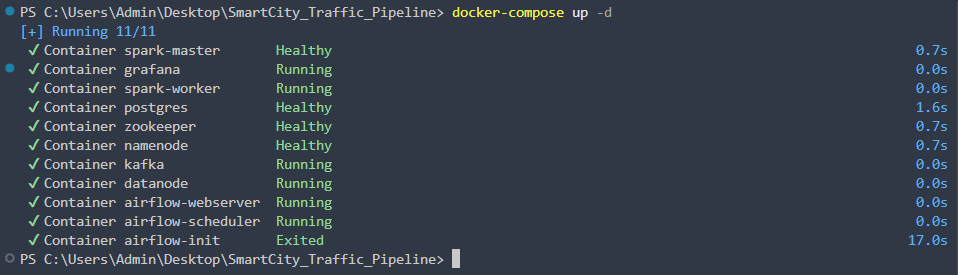
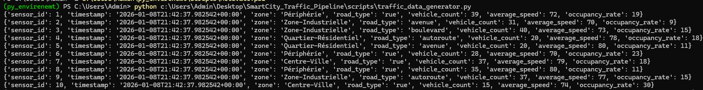
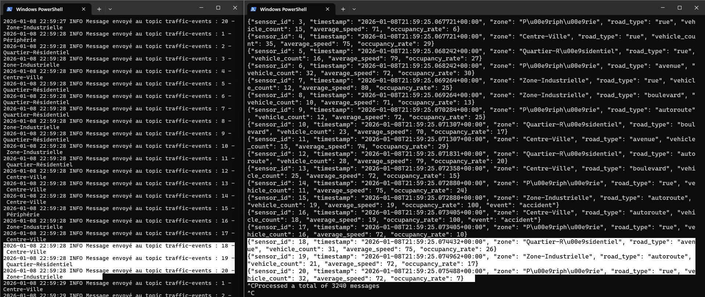
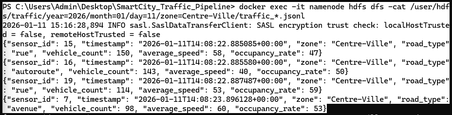
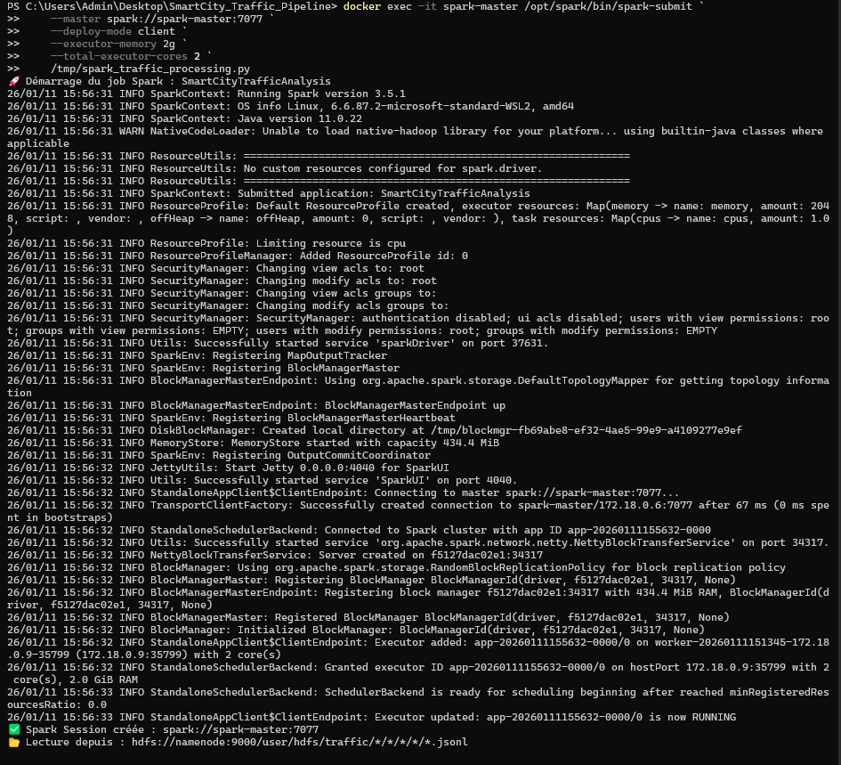
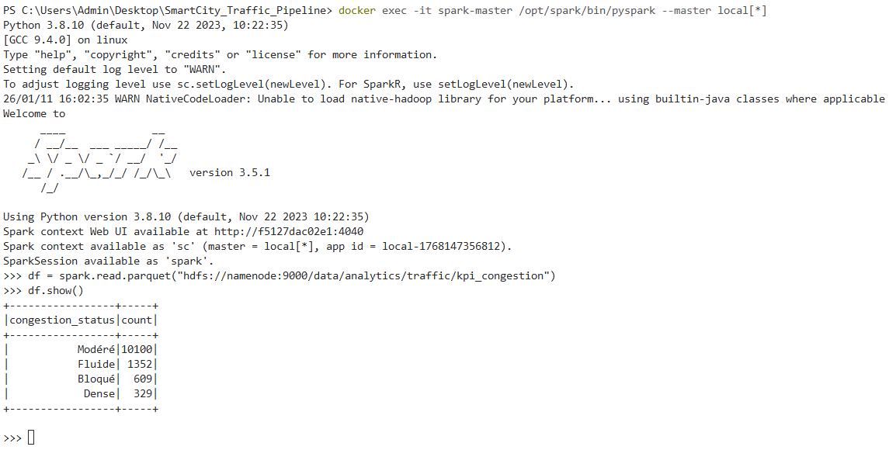
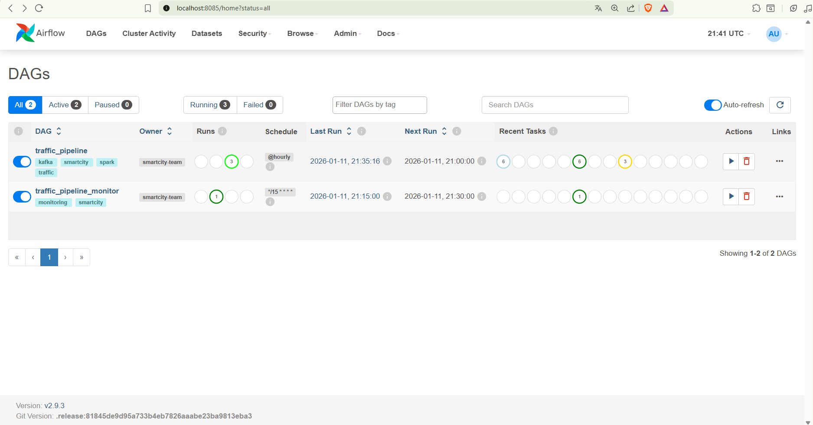
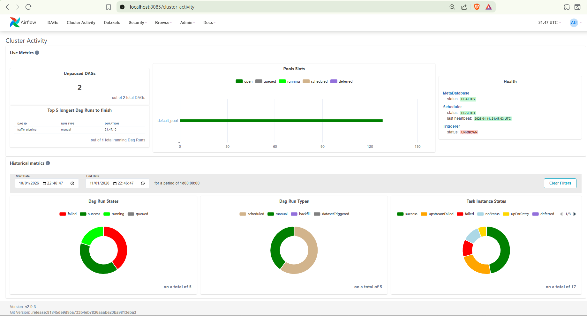

# Pipeline de Traitement de Données de Trafic SmartCity

<div align="center">
   
   
   
   
   


**Pipeline Big Data End-to-End pour l'analyse du trafic urbain en temps réel**

</div>

# I. Présentation du Projet

Ce projet met en œuvre un pipeline de traitement de données Big Data ("End-to-End") destiné à l'analyse en temps réel du trafic urbain. Le système ingère, traite et restitue des indicateurs clés de performance (KPIs) basés sur des données simulées de capteurs de trafic. L'architecture repose sur des standards industriels éprouvés garantissant scalabilité et résilience.

# II. Architecture Technique

Le flux de données suit une séquence linéaire orchestrée :

1. **Génération de Données :** Simulation de capteurs (zones, types de routes, vitesse, occupation).
2. **Ingestion :** Collecte des événements via Apache Kafka.
3. **Stockage :** Persistance des données brutes sur HDFS (Hadoop Distributed File System) avec partitionnement temporel.
4. **Traitement :** Agrégation et calul des métriques via Apache Spark.
5. **Orchestration :** Automatisation des tâches planifiées via Apache Airflow.
6. Restitution : Exposition des données via une API REST (FastAPI) et visualisation sur tableaux de bord Grafana.

# III. Prérequis Techniques

L'infrastructure repose entièrement sur la conteneurisation.

* Docker Desktop et Docker Compose.
* Environnement Python 3.8 ou supérieur.
* Allocation mémoire minimale recommandée : 8 Go de RAM.

# IV. Déploiement

1. **Initialisation de l'environnement**
   Exécutez la commande suivante pour démarrer l'ensemble des services définis dans le fichier docker-compose :

```powershell
docker compose up -d
```

2. **Configuration du Data Lake**
   Le répertoire de stockage HDFS doit être initialisé avec les droits appropriés :

```powershell
docker exec -it namenode hdfs dfs -mkdir -p /user/hdfs/traffic
docker exec -it namenode hdfs dfs -chown -R hdfs:hdfs /user/hdfs/traffic
```

3. **Démarrage du Producteur**
   Lancez le script de simulation pour alimenter le topic Kafka :

```powershell
python scripts/kafka_producer.py
```

4. **Configuration de l'Orchestrateur**
   Créez le compte administrateur pour l'interface Airflow :

```powershell
docker exec airflow-webserver airflow users create --username admin --firstname Admin --lastname User --role Admin --email admin@example.com --password admin
```

# V. Description des Étapes du Pipeline

1. **Génération de Données**
   Le script `scripts/traffic_data_generator.py` produit des événements JSON simulant l'activité de 20 capteurs répartis sur 4 zones géographiques. Les données incluent des variations temporelles et des simulations d'anomalies.



2. Ingestion des Messages
   Le producteur Kafka envoie les événements sur le topic `traffic-events` avec une garantie de livraison de type "all acks".




3. **Consommation et Stockage**
   Le service consommateur lit le flux Kafka et écrit les fichiers au format JSON Lines dans HDFS. Le partitionnement s'effectue selon la hiérarchie : Année / Mois / Jour / Zone.




4. **Traitement Distribué**
   Le job Spark `scripts/spark_traffic_processing.py` effectue les opérations suivantes :

* Lectures des fichiers bruts depuis HDFS.
* Nettoyage et déduplication des enregistrements.
* Calcul des indicateurs (vitesse moyenne, densité de trafic).
* Sauvegarde des résultats au format Parquet.




5. **Visualisation et Accès aux Données**
   Les données traitées sont accessibles via l'API REST pour intégration tierce, et consultables via Grafana pour l'analyse visuelle.


VI. Orchestration Automatisée

Le workflow est piloté par le DAG Airflow `traffic_pipeline`, configuré pour une exécution horaire. Il supervise la connectivité des services, le déclenchement des traitements et la validation des sorties.




# **VII. Documentation Complète**

La documentation détaillée des composants est disponible dans le répertoire `docs/` :

* Guide Airflow : `docs/AIRFLOW_GUIDE.md`
* Guide Grafana : `docs/GRAFANA_GUIDE.md`
* Guide Spark : `docs/SPARK_SUBMIT_GUIDE.md`
* Script de Présentation : `docs/PRESENTATION.md`
